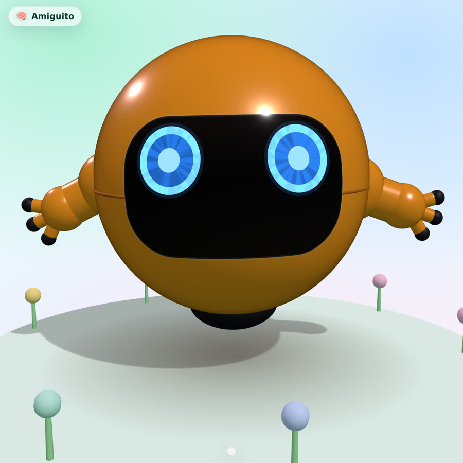
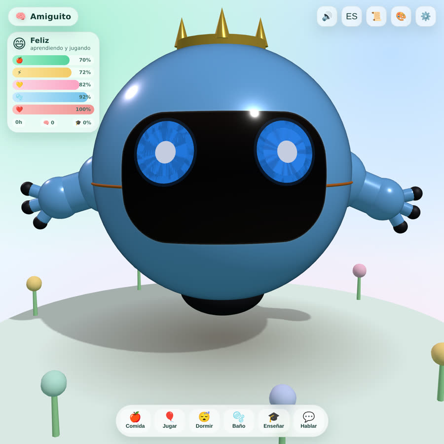
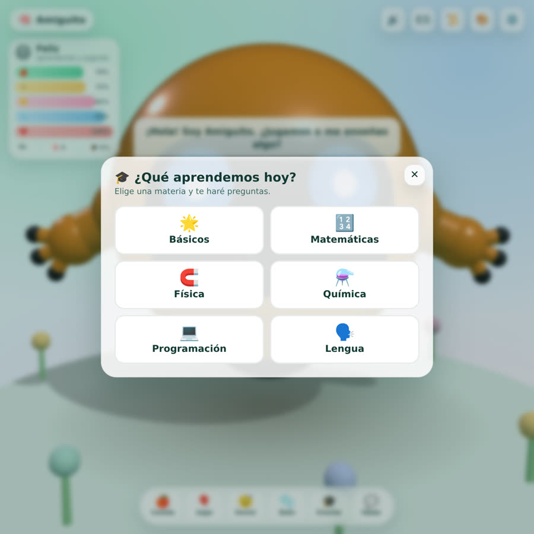
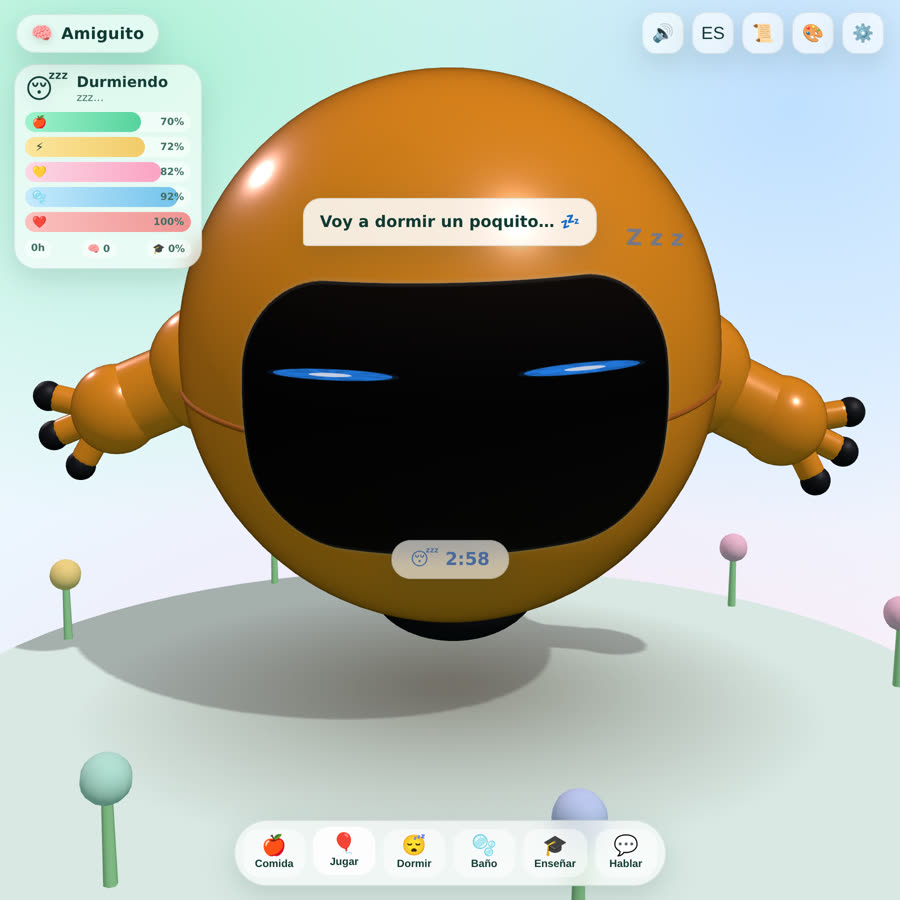
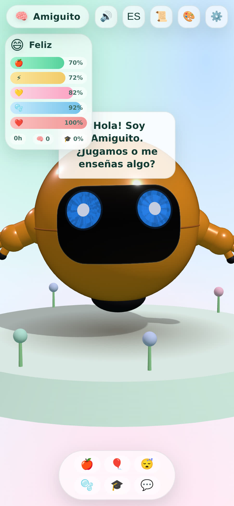

<div align="center">

# 🧠 Amiguito

**Una mascota virtual 3D para la web: adorable, con _machine learning_ de verdad, educativa, personalizable y con voz infantil.**

Funciona 100 % en el navegador: **sin servidores, sin claves de API y sin paso de compilación.**

[](https://aurenox-global.github.io/amiguito/)
[](./LICENSE)
[](https://nodejs.org)
[](#-stack-técnico)
[](https://threejs.org)

[**▶️ Probar la demo**](https://aurenox-global.github.io/amiguito/) · [Características](#-características) · [Materias](#-base-de-datos-de-materias) · [Cómo ejecutarlo](#-puesta-en-marcha)



</div>

---

## 📖 ¿Qué es Amiguito?

**Amiguito** es un amigo virtual para el navegador: un primito moderno del Tamagotchi. Es un **robot 3D flotante** que
**tiene vida propia** — come, juega, duerme, se aburre, se ensucia, aprende y te busca cuando quiere mimos — y además
**enseña** Matemáticas, Física, Química, Programación y Lengua, **habla con una voz infantil** y **se puede personalizar**.

No es un decorado: por dentro lleva un pequeño **cerebro que aprende de verdad** (aprendizaje por refuerzo + red
neuronal propias) y un sistema de **necesidades tipo Tamagotchi** que avanza con el **tiempo real**.

## ✨ Características

| | |
|---|---|
| 🤖 **Mascota 3D** | Robot esférico naranja, flotante, con visor y ojos que **siguen tu cursor**. Generado 100 % por código con Three.js (no hay `.glb` que pueda faltar). |
| 🧠 **Machine Learning real** | _Q-Learning_ tabular (aprende qué acción le conviene) + **red neuronal MLP con backprop desde cero** (auto-modelo). Personalidad que evoluciona. |
| 🎓 **Educación** | Materias **bilingües** (es/en): Matemáticas, Física, Química, Programación, Lengua y Básicos. Las preguntas viven en **archivos JSON en el repo**. |
| 🗣️ **Voz infantil** | Voces **propias** (Piper) incluidas en `assets/audio`, con transformación de tono ±formantes para sonar a niña. Reserva con Web Speech. |
| 🎤 **Hablar por voz** | **Mantén pulsada** la pantalla y háblale: te escucha (Speech Recognition) y responde por voz. |
| 🎨 **Personalización** | Color del **cuerpo**, color de los **ojos** y **accesorios** (gorro 🎉, corona 👑, lazo 🎀). Se guarda en el dispositivo. |
| 😴 **Siesta con cuenta atrás** | Cuando duerme **no reacciona a nada** y muestra un contador **"😴 m:ss"**. La energía sube durante el sueño. |
| 📱 **Responsive** | Se adapta a móvil (la cámara se aleja en vertical). Toques solo cuando tocas **a la mascota**. |
| 💾 **Persistente** | No se pierde nada al recargar: necesidades, siesta, personalización, nombre, chat, aprendizaje… |
| 🧩 **Sin dependencias** | HTML + **ES Modules** de serie. `runtime deps: 0`. Solo se usa Node para el servidor de desarrollo y los tests. |

<table>
<tr>
<td></td>
<td></td>
</tr>
<tr>
<td align="center"><sub>🎨 Personalización: colores + accesorios</sub></td>
<td align="center"><sub>🎓 Selección de materias</sub></td>
</tr>
<tr>
<td></td>
<td></td>
</tr>
<tr>
<td align="center"><sub>😴 Siesta con cuenta regresiva</sub></td>
<td align="center"><sub>📱 Adaptado a móvil</sub></td>
</tr>
</table>

## 🧬 La mascota (3D, sin errores de carga)

- Diseño construido **por completo con geometrías de Three.js**: nunca falla por un modelo externo ausente.
- Cuerpo esférico brillante con **visor**, **ojos anillados que siguen el cursor**, bracitos con pinzas y **tobera** de flotación.
- **Animaciones suaves** con máquina de estados + _one-shots_ (saltar, girar, comer, celebrar, saludar…) y saludo **ocasional** (no permanente).
- Iluminación cuidada, plataforma y jardín decorados, sombra de contacto.
- **Personalización en vivo**: `creature.setPalette({body, eye})` y `creature.setAccessory('gorro' | 'corona' | 'lazo')`.

## 🧠 Machine Learning de verdad

El "cerebro" vive en `src/brain/` y **no usa librerías**: es código propio, pequeño y testeado.

1. **Aprendizaje por refuerzo — Q-Learning tabular** (`brain/qlearning.js`). Discretiza el estado (hambre, energía, ánimo, aburrimiento, limpieza) y aprende por prueba y error qué acción le conviene (descansar, pasear, jugar solo, reflexionar, buscarte, acicalarse). Ecuación de Bellman + _ε-greedy_ con decaimiento.
2. **Red neuronal propia — MLP con retropropagación** (`brain/neural.js`). Auto-modelo: predice cómo se siente y ajusta pesos con descenso de gradiente (`forward`, `backprop`, serialización).
3. **Personalidad evolutiva** (`brain/personality.js`). Rasgos (curiosidad, sociabilidad, apetito…) que **derivan según cómo la cuidas** y modulan sus recompensas y temperamento.
4. **Repetición espaciada SM-2** (`src/spaced.js`). Repasa lo que peor sabe y menos lo que ya domina.

Todo el aprendizaje **se guarda** en `localStorage`.

## 🗣️ Voz y audio

- **Voces propias incluidas** en `assets/audio/{es,en}` (82 clips), generadas con **Piper** y una transformación de
  **tono + formantes** (_rubberband_) para que suenen **infantiles** en cualquier dispositivo, sin depender de las voces del navegador.
- Reserva automática con **Web Speech API** (prefiere voces femeninas y tono agudo) si falta un clip o está desactivado.
- **Reconocimiento de voz** para chatear y responder el quiz.

<details>
<summary><b>🎙️ Regenerar los audios</b></summary>

```bash
# PITCH = factor de tono, TEMPO = velocidad, LANG = es | en | all
bash tools/gen-audio.sh 1.22 1.06            # todos, voz infantil
bash tools/gen-audio.sh 1.22 1.06 en         # solo inglés
```

> ⚠️ El script usa `ffmpeg -nostdin` a propósito: sin eso, `ffmpeg` consume la lista de frases del bucle por *stdin* y solo se genera el primer audio.

</details>

## 📚 Base de datos de materias

Cada materia es un **JSON bilingüe** en `data/`: `math.json`, `physics.json`, `chemistry.json`, `programming.json`, `language.json`.
El amiguito **enseña en español si eliges español y en inglés si eliges inglés**.

```jsonc
{
  "subject": "math",
  "icon": "🔢",
  "name": { "es": "Matemáticas", "en": "Math" },
  "levels": [
    {
      "title": { "es": "Contar y sumar", "en": "Counting & adding" },
      "items": [
        {
          "q":       { "es": "¿Cuánto es 2 + 3?", "en": "What is 2 + 3?" },
          "options": { "es": ["4", "5", "6"],     "en": ["4", "5", "6"] },
          "answer": 1,
          "why":     { "es": "2 + 3 = 5.",        "en": "2 + 3 = 5." }
        }
      ]
    }
  ]
}
```

**Añadir una materia:** crea `data/<id>.json` con ese esquema y añádela a `SUBJECTS` en `src/education.js`. Nada más.

## 💛 Sistema tipo Tamagotchi

Hambre, energía, alegría, limpieza y salud decaen con el **tiempo real**: si cierras la web, **sigue viviendo**
(hasta una semana). Cuídalo y crecerá; descuidado, se pondrá triste o enfermo.

- **Dormir** crea una **siesta con cuenta atrás** (2–10 min según cansancio); mientras duerme **no reacciona** a nada.
- Estado **persistente**: al recargar continúa la siesta, se conservan las necesidades, la personalización y el aprendizaje.

## 🚀 Puesta en marcha

```bash
git clone https://github.com/aurenox-global/amiguito.git
cd amiguito
npm start        # servidor estático sin dependencias → http://localhost:5173
npm test         # tests del cerebro y del sistema de necesidades (node --test)
```

> Solo necesitas **Node 18+** para el servidor de desarrollo y los tests. La app **no necesita build**: es HTML + ES Modules.

### 🌐 Despliegue

El repositorio incluye `.github/workflows/` con **GitHub Pages**. Al hacer *push* a `main` se publica solo
(*Settings → Pages → origen: GitHub Actions*).

**Demo:** <https://aurenox-global.github.io/amiguito/>

## 🗂️ Estructura

```
amiguito/
├── index.html               # estructura + UI
├── styles.css               # interfaz pastel, responsive
├── data/                    # 📚 "base de datos" de materias (JSON bilingüe)
│   ├── math.json  physics.json  chemistry.json
│   └── programming.json  language.json
├── assets/
│   ├── favicon.svg
│   └── audio/{es,en}/        # 🗣️ 82 clips de voz infantil (Piper)
├── src/
│   ├── main.js               # escena 3D, ciclo de vida, siesta, personalización
│   ├── creature.js           # mascota 3D + animaciones + paleta/accesorios
│   ├── needs.js              # sistema Tamagotchi (incl. siesta y cuenta atrás)
│   ├── education.js          # materias + carga de data/*.json + lecciones
│   ├── spaced.js             # repetición espaciada (SM-2)
│   ├── voice.js              # Web Speech (voz + reconocimiento)
│   ├── audio.js              # reproductor de la voz propia (mp3)
│   ├── i18n.js               # español / inglés
│   ├── store.js              # guardado + exportar/importar
│   ├── ui.js                 # HUD, burbujas, diario, materias, personalizar, quiz
│   └── brain/                # neural.js · qlearning.js · personality.js
├── tools/
│   ├── serve.mjs             # servidor estático mínimo
│   ├── gen-voice.mjs         # genera frases + manifiesto
│   ├── gen-audio.sh          # genera los mp3 (Piper + rubberband)
│   └── shot.py               # captura de pantalla con Playwright
├── tests/                    # node --test (sin frameworks)
├── vendor/                   # Three.js local (sin CDN)
└── docs/                     # capturas para este README
```

## 🧪 Calidad

- Tests unitarios con `node --test` que cubren la red neuronal, Q-Learning, el sistema de necesidades y la repetición espaciada.
- Código modular y comentado en español, **0 dependencias de runtime**.
- Verificación visual automatizada con Playwright (`tools/shot.py`).

## 🛣️ Roadmap

- [ ] Más materias (música, geografía, historia) y niveles de dificultad.
- [ ] Ampliar la base de datos de cada materia.
- [ ] Más accesorios y "caritas" para personalizar.
- [ ] Exportar/importar el "ADN" del amiguito para compartirlo.
- [ ] Modo "dos amiguitos" que interactúan entre sí.
- [ ] LLM opcional para conversaciones libres (manteniendo el modo local por defecto).

## 🤝 Contribuir

¡Las _issues_ y _pull requests_ son bienvenidas! Para añadir preguntas, edita los archivos de `data/`; para nuevas
materias, añade el JSON y regístralo en `src/education.js`.

## 📄 Licencia

**MIT** © 2026 Andrés · [aurenox-global](https://github.com/aurenox-global) — ver [`LICENSE`](./LICENSE).

---

<details>
<summary><b>English</b></summary>

**Amiguito** is an adorable **3D virtual robot pet for the web** with genuine machine learning (tabular
Q-Learning + a from-scratch neural net), a Tamagotchi-style needs system, **bilingual educational subjects**
(Math, Physics, Chemistry, Programming, Language), an included **childlike voice** (Piper) and full
customization (colors + accessories). It runs **entirely in the browser** — no build step, no servers, no API keys.

- **Live demo:** <https://aurenox-global.github.io/amiguito/>
- **Subjects DB:** `data/*.json` (bilingual), extendable without writing code.
- **Run it:** `npm start` → <http://localhost:5173> · **Test:** `npm test`
- Push to `main` to deploy to GitHub Pages.

MIT © 2026 Andrés · aurenox-global

</details>
